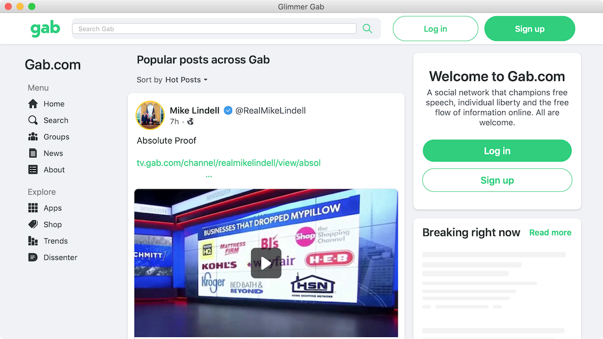

#  Glimmer Gab

Desktop App for [Gab.com](https://gab.com)

It is free and open source under the [MIT License](LICENSE.txt).

The app remembers your logged in user if you close and open again.

## Download

[ Download Glimmer Gab on the Mac](https://www.dropbox.com/s/etzckmepthgwjj2/Glimmer%20Gab-1.0.0.dmg?dl=1)

## Install & Usage

### Mac

Click the [downloaded](#download) app DMG file and it presents you with a screen to drag the Glimmer Gab icon to Applications.

After dragging to Application, go into Applications and double-click the Glimmer Gab app to launch it. You should see its icon in the Mac Dock.

Once the app shows up, simply log in and start using Gab just like the [Gab.com](https://gab.com) website.

## Contributing to Glimmer Gab

Currently, this app is just a wrapper around the website using [Glimmer DSL for SWT Scaffold Desktopify](https://github.com/AndyObtiva/glimmer-dsl-swt#desktopify)

-   Check out the latest master to make sure the feature hasn't been
    implemented or the bug hasn't been fixed yet.
-   Check out the issue tracker to make sure someone already hasn't
    requested it and/or contributed it.
-   Fork the project.
-   Start a feature/bugfix branch.
-   Commit and push until you are happy with your contribution.
-   Make sure to add tests for it. This is important so I don't break it
    in a future version unintentionally.
-   Please try not to mess with the Rakefile, version, or history. If
    you want to have your own version, or is otherwise necessary, that
    is fine, but please isolate to its own commit so I can cherry-pick
    around it.

## Copyright

[MIT](LICENSE.txt)

Copyright (c) 2021 Andy Maleh.

---

 Built with [Glimmer DSL for SWT](https://github.com/AndyObtiva/glimmer-dsl-swt) (JRuby Desktop Development GUI Framework)
